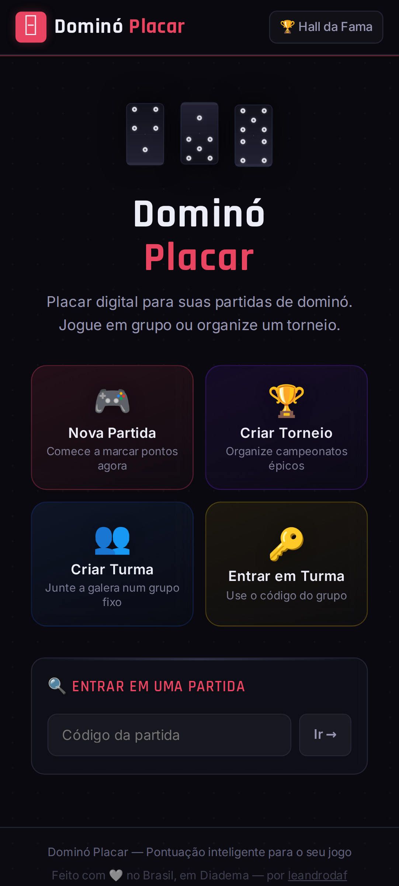
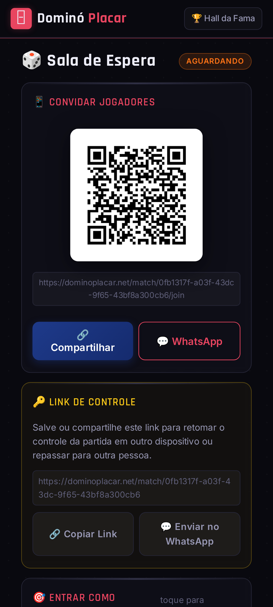
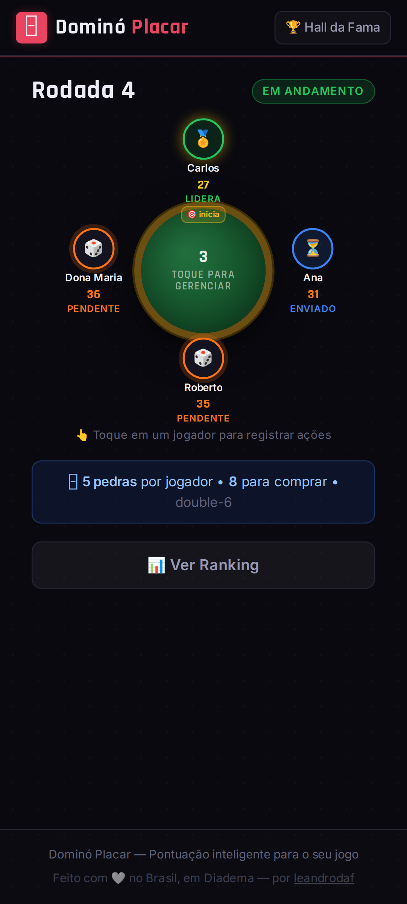
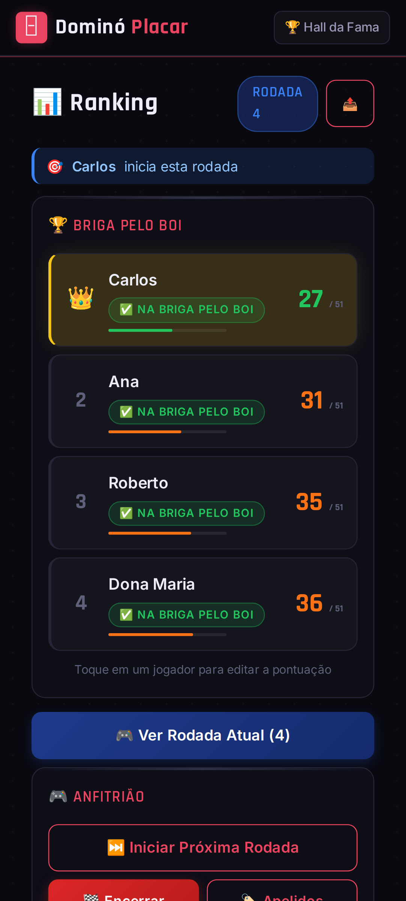
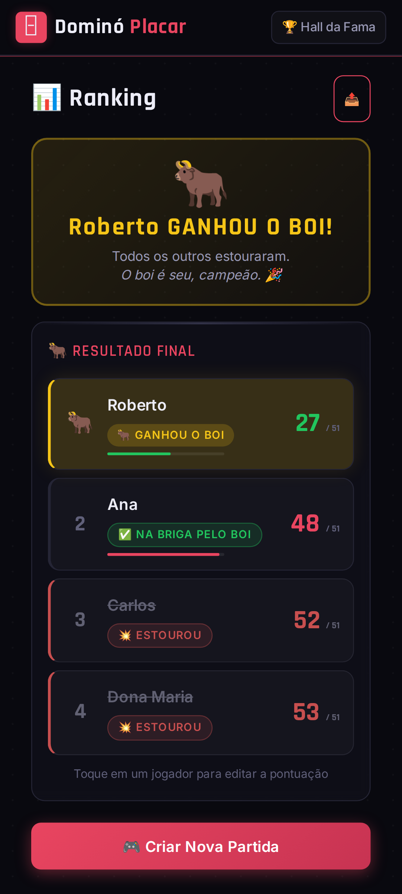
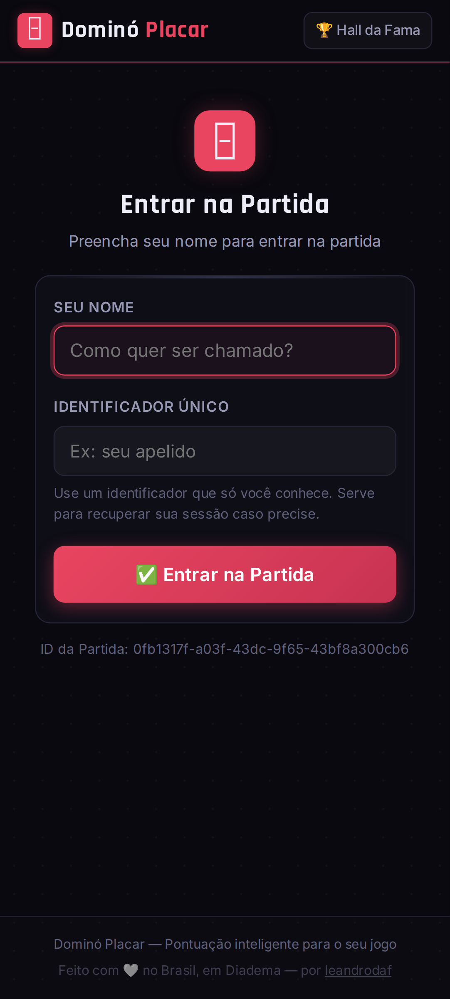

# 🁣 Dominó Placar

[](https://go.dev)
[](LICENSE)
[](#deploy-on-google-cloud-cloud-run)
[](https://dominoplacar.net)

> Real-time digital scoreboard for **Pontinho** — the Brazilian domino game with a 51-point bust limit.
> Runs on any player's phone browser, zero installation required.
>
> 🌐 **Try it now → [dominoplacar.net](https://dominoplacar.net)**
>
> Made with 🤍 in Diadema, SP — by [leandrodaf](https://github.com/leandrodaf)

---

## Screenshots

<p align="center">
  
  
  
  
  
  
</p>

---

## Features

- **Real-time** — scores update instantly for everyone via Server-Sent Events (SSE)
- **QR Code** — host shares a QR code so players can join the room
- **Tile detection via photo** — snap a picture of remaining tiles and the system auto-detects them (via Roboflow)
- **Multi-table tournaments** — tournament support with automatic table allocation
- **Mobile-first** — designed for phones, premium dark theme
- **Zero install** — works right in the browser, no app needed
- **Hall of Fame** — persistent global ranking across matches
- **Nicknames** — nickname system with player voting
- **i18n** — Portuguese and English, auto-detected from the browser
- **Dual storage** — SQLite for local dev, Firebase Realtime Database for production

---

## What is it

**Dominó Placar** is a web app designed to be opened on your phone during a domino game. The host creates a room, shares the QR code, and each player joins with their name. When the round ends, each player photographs their remaining tiles (or enters points manually) and the scoreboard updates in real time for everyone.

---

## Pontinho Rules

### Goal
Be the last player standing. Anyone who accumulates **more than 51 total points** is out (bust).

### Scoring per round
- Each player sums the points on their remaining tiles at the end of the round
- The **round winner** (played all tiles, or locked the board with fewest points) scores **0 points**
- Each tile is worth the **sum of its two sides**
- Exception: the `[0|0]` tile alone in hand is worth **12 points**

### Tile distribution

| Players | Tiles per player | Draw pile | Set     |
|:-------:|:----------------:|:---------:|:-------:|
| 2       | 9                | 10        | Double-6 |
| 3       | 6                | 10        | Double-6 |
| 4       | 5                | 8         | Double-6 |
| 5       | 7                | 20        | Double-9 |
| 6       | 6                | 19        | Double-9 |
| 7       | 5                | 20        | Double-9 |
| 8       | 4                | 23        | Double-9 |
| 9       | 4                | 19        | Double-9 |
| 10      | 3                | 25        | Double-9 |

> **Double-6** = 28 tiles · **Double-9** = 55 tiles

---

## Running locally

### Prerequisites

- **Go 1.26+** — [download](https://go.dev/dl/)

### Installation

```bash
git clone https://github.com/leandrodaf/domino-placar
cd domino-placar
go mod download
```

### Run (simplest way)

```bash
go run main.go
```

Open [http://localhost:8080](http://localhost:8080).

> By default it uses a local **SQLite** database (`domino.db`). No environment variables are required to run locally.

### Play on Wi-Fi (other phones on the same network)

Find your machine's local IP and access it from your phone:

```bash
# macOS
ipconfig getifaddr en0

# Linux
hostname -I | awk '{print $1}'
```

Then open `http://<YOUR-IP>:8080` in your phone's browser. Invite links and QR codes automatically use the address you accessed.

---

## Environment variables

### Required in production

| Variable | Description | Example |
|----------|-------------|---------|
| `SESSION_SECRET` | HMAC secret for signing cookies and CSRF tokens. **Always set in production.** Without it, sessions are invalidated on every server restart. | `my-long-secret-key` |

### Optional

| Variable | Description | Default |
|----------|-------------|---------|
| `PORT` | HTTP server port | `8080` |
| `TRUST_PROXY` | If set (any value), trusts the `X-Forwarded-For` header for real client IP (only use behind a trusted reverse proxy) | not set |

### Firebase Realtime Database (replaces SQLite)

| Variable | Description |
|----------|-------------|
| `FIREBASE_DATABASE_URL` | Firebase database URL, e.g. `https://my-project-default-rtdb.firebaseio.com` |
| `FIREBASE_CREDENTIALS` | Service Account JSON (content, not path). If omitted, uses Application Default Credentials (ADC) — works automatically on GCP. |

> When `FIREBASE_DATABASE_URL` is set, the app uses Firebase. Otherwise, it uses SQLite.

### Google Cloud Storage (player photos)

| Variable | Description |
|----------|-------------|
| `GCS_BUCKET` | GCS bucket name for storing photos, e.g. `domino-placar-photos` |
| `GCS_CREDENTIALS` | Service Account JSON (content, not path). If omitted, uses ADC — works automatically on GCP. |

> When `GCS_BUCKET` is set, photos go to GCS. Otherwise, they're saved to the local `uploads/` folder.

### Computer vision — Roboflow (automatic tile detection)

| Variable | Description | Default |
|----------|-------------|---------|
| `ROBOFLOW_API_KEY` | Roboflow API key. Without it, only manual point entry works. | — |
| `ROBOFLOW_MODEL` | Roboflow domino detection model name | `domino-detection` |
| `ROBOFLOW_VERSION` | Model version | `1` |

> When `ROBOFLOW_API_KEY` is set, players can photograph remaining tiles and the system automatically detects them and calculates points. Without the key, the app works normally with manual entry.

---

## Deploy on Google Cloud (Cloud Run)

### 1. Set up Firebase

1. Go to [console.firebase.google.com](https://console.firebase.google.com)
2. Create a project or use an existing one
3. Enable **Realtime Database** (Spark plan is free)
4. Note the URL: `https://YOUR-PROJECT-default-rtdb.firebaseio.com`

### 2. Set up GCS (for photos)

```bash
# Create the bucket
gsutil mb -l southamerica-east1 gs://domino-placar-photos

# Public read access (optional, to display photos in the app)
gsutil iam ch allUsers:objectViewer gs://domino-placar-photos
```

### 3. Build and deploy to Cloud Run

```bash
# Build the image
docker build -t gcr.io/YOUR-PROJECT/domino-placar .

# Push
docker push gcr.io/YOUR-PROJECT/domino-placar

# Deploy
gcloud run deploy domino-placar \
  --image gcr.io/YOUR-PROJECT/domino-placar \
  --platform managed \
  --region southamerica-east1 \
  --allow-unauthenticated \
  --set-env-vars "SESSION_SECRET=your-secret-key,FIREBASE_DATABASE_URL=https://YOUR-PROJECT-default-rtdb.firebaseio.com,GCS_BUCKET=domino-placar-photos,TRUST_PROXY=true"
```

> On Cloud Run, GCP credentials are automatic via ADC — no need for `FIREBASE_CREDENTIALS` or `GCS_CREDENTIALS`.

### Dockerfile

```dockerfile
FROM golang:1.26-alpine AS builder
WORKDIR /app
COPY . .
RUN go build -o domino-placar .

FROM alpine:latest
WORKDIR /app
COPY --from=builder /app/domino-placar .
COPY static/ static/
COPY templates/ templates/
EXPOSE 8080
CMD ["./domino-placar"]
```

---

## Running with all integrations (local .env example)

```bash
# .env (load with: export $(cat .env | xargs) && go run main.go)

SESSION_SECRET=replace-with-a-long-random-string

# Firebase (database)
FIREBASE_DATABASE_URL=https://my-project-default-rtdb.firebaseio.com
# FIREBASE_CREDENTIALS={"type":"service_account",...}  # Only if not on GCP

# GCS (photos)
GCS_BUCKET=domino-placar-photos
# GCS_CREDENTIALS={"type":"service_account",...}  # Only if not on GCP

# Roboflow (automatic tile detection — optional)
ROBOFLOW_API_KEY=your-roboflow-key
# ROBOFLOW_MODEL=domino-detection
# ROBOFLOW_VERSION=1

PORT=8080
```

Load and run:

```bash
export $(grep -v '^#' .env | xargs) && go run main.go
```

---

## Why SESSION_SECRET matters

Without `SESSION_SECRET`, the server generates a random secret on every start. This means:

- Host and player cookies are invalidated on every restart
- CSRF tokens become invalid — forms return **"invalid security token"**
- During development, this happens every time you restart with `go run`

**Fix**: set `SESSION_SECRET` to any long string:

```bash
SESSION_SECRET=any-long-hard-to-guess-string go run main.go
```

---

## Project structure

```
domino-placar/
├── main.go                      # Entrypoint, routing, middleware
├── go.mod
├── domino.db                    # SQLite database (auto-created, dev only)
├── uploads/                     # Local photos (dev only; prod uses GCS)
├── static/
│   └── style.css                # Design system — mobile-first dark theme
├── templates/
│   ├── base.html                # Base layout with nav and footer
│   ├── home.html                # Home page
│   ├── lobby.html               # Waiting room (host)
│   ├── join.html                # Join match (player)
│   ├── waiting.html             # Waiting for game to start
│   ├── game.html                # Live game table
│   ├── upload.html              # Photograph tiles / manual entry
│   ├── confirm.html             # Confirm round score
│   ├── ranking.html             # Match scoreboard
│   ├── nicknames.html           # Nicknames and voting
│   ├── global-ranking.html      # Hall of Fame (global)
│   └── tournament-*.html        # Multi-table tournaments
└── internal/
    ├── db/
    │   ├── store.go             # Store interface (database abstraction)
    │   ├── sqlite_store.go      # SQLite implementation
    │   ├── firebase_store.go    # Firebase Realtime DB implementation
    │   └── db.go                # SQLite schema and helpers
    ├── i18n/
    │   ├── i18n.go              # Internationalization (T, TH, DetectLang)
    │   └── locales/
    │       ├── pt.json          # Portuguese translations
    │       └── en.json          # English translations
    ├── models/models.go         # Domain structs
    ├── handler/
    │   ├── security.go          # HMAC cookies, CSRF, rate limiting, headers
    │   ├── pages.go             # Page rendering handlers
    │   ├── match.go             # Create/start match
    │   ├── round.go             # Round management and winners
    │   ├── upload.go            # Photo upload and confirmation
    │   ├── nickname.go          # Nickname system
    │   ├── tournament.go        # Multi-table tournaments
    │   ├── tiles.go             # Tile distribution calculation
    │   └── sse.go               # Server-Sent Events (real-time)
    └── service/
        ├── image.go             # Image compression and validation
        ├── storage.go           # Google Cloud Storage upload
        ├── vision.go            # Tile detection via Roboflow (computer vision)
        └── qrcode.go            # QR code generation
```

---

## Security

- **HMAC-signed cookies**: host and players authenticated via cryptographic cookies
- **CSRF tokens**: HMAC-based, hourly rotation, validated on all POST forms
- **Rate limiting**: 5 uploads/5min per IP · 60 POST actions/min per IP
- **Input sanitization**: all user fields are sanitized server-side
- **CSP**: restrictive Content-Security-Policy on all responses
- **Max score**: scores above 200 are rejected by the server

---

## Contributing

Contributions are welcome! Feel free to open issues and pull requests.

1. Fork the project
2. Create a branch (`git checkout -b feat/my-feature`)
3. Commit your changes (`git commit -m 'feat: my feature'`)
4. Push to the branch (`git push origin feat/my-feature`)
5. Open a Pull Request

---

## License

This project is licensed under the MIT License — see the [LICENSE](LICENSE) file for details.

Made with 🤍 in Diadema, SP, Brazil.
